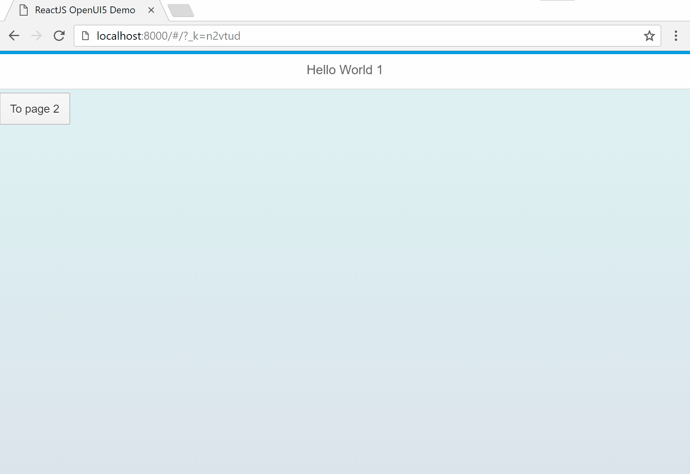
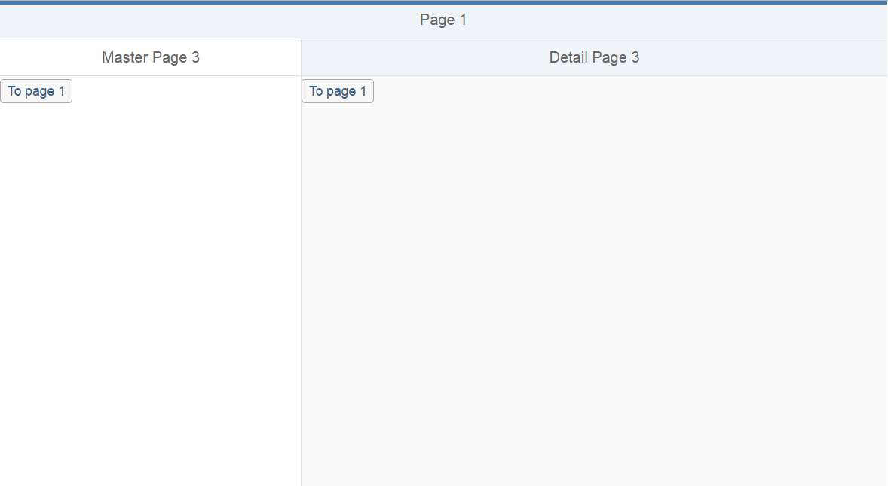
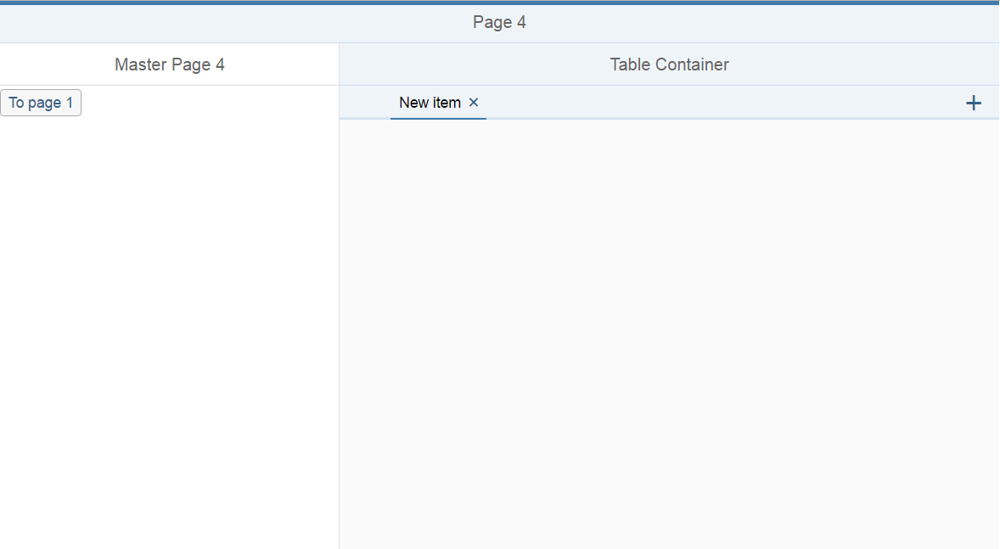

# React UI5

[](https://nodei.co/npm/react-ui5/)

[build-badge]: https://travis-ci.org/alessh/react-ui5.svg?branch=master
[build]: https://travis-ci.org/alessh/react-ui5

[npm-badge]: https://img.shields.io/npm/v/npm-package.png?style=flat-square
[npm]: https://www.npmjs.org/package/react-ui5

[coveralls-badge]: https://img.shields.io/coveralls/user/repo/master.png?style=flat-square
[coveralls]: https://coveralls.io/github/user/repo

[![Travis][build-badge]][build]
[![npm package][npm-badge]][npm]
[![Coveralls][coveralls-badge]][coveralls]

A react based implementation of the SAP OpenUI5 framework (https://openui5.hana.ondemand.com).

Installation
```javascript
npm install react-ui5 --save
```
Use
```javascript
import sap from 'react-ui5'
```
Home Page (index.html)
```html
<!DOCTYPE html>
<html>
  <head>
    <meta charset="utf-8">
    <meta name="viewport" content="width=device-width, initial-scale=1, shrink-to-fit=no">
    <meta http-equiv="x-ua-compatible" content="ie=edge">
    <title>React-UI5 App</title>
  </head>
  <body>
    <div id="app"></div>
  </body>
</html>
```
App.js
```
import React from 'react'
import {render} from 'react-dom'

import sap from 'react-ui5'

render((
  <sap.m.Shell>
    <sap.m.Page title='Page 1'>
      <sap.m.Button >
          To page 2
      </sap.m.Button>
    </sap.m.Page>
  <sap.m.Shell>
), document.getElementById('app'))
```



Supported Components

| component | methods | progress |
| ------- | ---------------- | ------ |
| Shell  |  | 90% |
| Page | title | 80% |
| Button |  | 50% |
| TabContainer |  | 40% |
| SplitContainer |  | 30% |
| TabSplit |  | 20% |

```
<SplitContainer />
```


```
<TabContainer />
```



